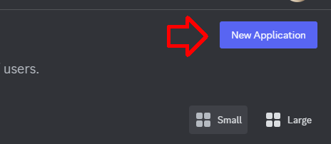
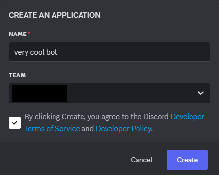
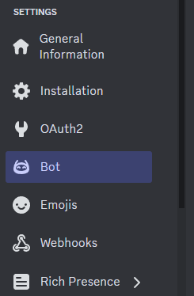
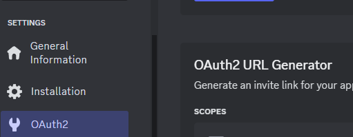
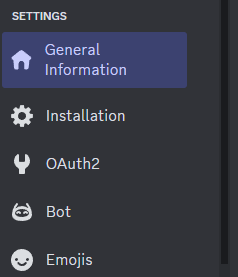
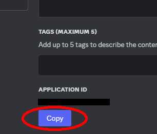
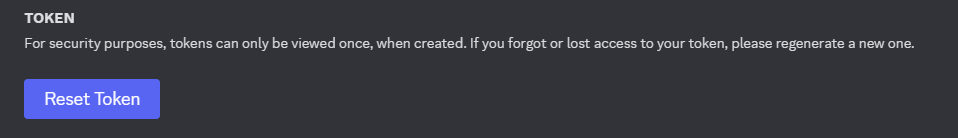
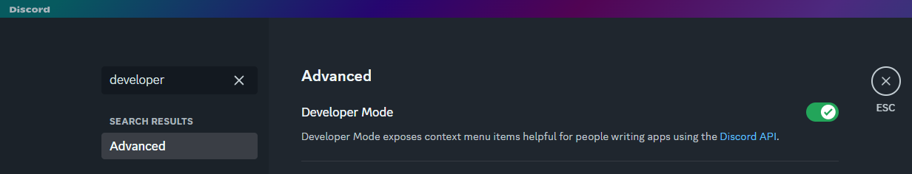
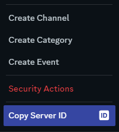

# Super-Modular-Discord-Bot

*Kriz_cold's custom all-purpose Typescript ready Discord bot*

This bot is designed to work with self-contained commands and events, automating the process of adding/removing features to the bot. Once set up, it should be as simple as adding a new file to the commands or events folder, and restarting the bot.

---

<details>
<summary style="font-weight: bold; font-size: 1.5em; cursor: pointer;">📒 Registering the Bot Account</summary>

*(If you already have a registered bot account, you can skip this)*

1.  **Create Application:** First, you need to create a new application in the Discord Developer Portal:
    * Make sure you are logged in to your Discord account on your browser.
    * Go to <https://discord.com/developers/applications> and click on "New Application".
    
    

2.  **Name Application:** Give your application (bot) a name, and click on "Create".

    

3.  **Bot Settings:** In the left menu, click on "Bot". Here you can set the bot's icon and username.

    

4.  **Enable Intents:** Scroll down in the "Bot" section to "Privileged Gateway Intents". Enable the following options:
    * ✅ **Presence Intent**
    * ✅ **Server Members Intent**
    * ✅ **Message Content Intent**
    * Click **Save Changes**.
    *(These intents grant your bot necessary permissions to see user statuses, member lists, and message content, which are often required for common bot features.)*

</details>

---

<details>
<summary style="font-weight: bold; font-size: 1.5em; cursor: pointer;">➕ Adding the Bot to Your Server</summary>

1.  **URL Generator:** In the Discord Developer Portal, go to **OAuth2** → **URL Generator**.

    

2.  **Select Scopes:** Choose the following **Scopes**:
    * `bot` (Allows the application to join servers as a bot)
    * `applications.commands` (Allows the bot to register slash commands)
    > <span style="color:gray;">[ i ] *Other scopes for advanced features can be found in the documentation:* <https://discord.com/developers/docs/topics/oauth2#shared-resources-oauth2-scopes></span>

3.  **Set Permissions:** Scroll down and select **Bot permissions** based on what functionalities your bot will need. For testing or if unsure, you can select **Administrator**, but grant permissions carefully for production bots.

4.  **Invite:** Copy the generated URL at the bottom and paste it into your browser's address bar.

5.  **Authorize:** Select the server you want to add the bot to from the dropdown menu and click "Continue", then "Authorize". Complete any verification steps (like CAPTCHA).

</details>

---

<details>
<summary style="font-weight: bold; font-size: 1.5em; cursor: pointer;">🔑 Getting Credentials for Hosting</summary>

You will need the bot's **Discord Token**, **Client ID**, and your **Test Server (Guild) ID** to configure and run the bot.

**Client ID (Application ID):**

1.  In the Discord Developer Portal, go to the **OAuth2** → **General** tab.

    
2.  Copy the **APPLICATION ID** and save it securely.

    

**Discord Token:**

1.  In the Discord Developer Portal, go to the **Bot** tab.

    
2.  Under the bot's username, find the "Token" section. Click **Reset Token**. Confirm the action.

    
3.  **Immediately copy the new token and save it securely.** You will not be able to see it again after closing the window. **Never share this token publicly.**

**Guild ID (Test Server ID):**

1.  **Enable Developer Mode:** In your Discord client (desktop or web), go to User Settings → Advanced → Enable **Developer Mode**.

    
2.  **Copy Server ID:** Go to the server you want to use for testing. Right-click on the server's icon or name in the server list on the left and click **Copy Server ID**.

    

### Hosting Options

#### Host Using Yundera

> [ ! ] Work in progress - Instructions needed.
> * You will need the **Client ID**, **Discord Token**, and **Test Guild ID** obtained above.

#### Self-Hosting

> [ ! ] To Do - Detailed steps for different environments (e.g., Docker, PM2, systemd) needed.

* **Environment Variables:** Create a `.env` file in the root folder of the project. Add your credentials like this:
    ```env
    # .env file
    DISCORD_TOKEN=YOUR_DISCORD_BOT_TOKEN_HERE
    GUILD_ID=YOUR_TEST_SERVER_ID_HERE
    CLIENT_ID=YOUR_BOT_APPLICATION_ID_HERE
    # Optional: Add developer IDs separated by commas
    # DEVS=YOUR_USER_ID,ANOTHER_USER_ID
    ```
* Replace the placeholder values with the actual credentials you copied earlier.

</details>

---

<details>
<summary style="font-weight: bold; font-size: 1.5em; cursor: pointer;">▶️ Running the Bot</summary>

#### Using Yundera

> [ ! ] Work in progress - Instructions needed.

#### Self-Hosting (Development)

> [ ! ] To Do - Instructions for production running needed.

1.  **Node.js:** Ensure you have Node.js installed (LTS version recommended). Download from <https://nodejs.org/>.
2.  **Install Dependencies:** Open a terminal or command prompt in the project's root folder and run:
    ```bash
    npm install
    ```
3.  **Create `.env` File:** Make sure you have created the `.env` file with your credentials as described in the "For Hosting" section.
4.  **Run in Development Mode:** Start the bot using nodemon for automatic restarts on code changes:
    ```bash
    npm run dev
    ```
    *(This uses `ts-node` to run TypeScript directly.)*
5.  **Build and Run (Production-like):** To compile TypeScript and run the JavaScript output:
    ```bash
    npm run build
    npm run start
    ```

</details>

---

<details>
<summary style="font-weight: bold; font-size: 1.5em; cursor: pointer;">💻 For Development</summary>

### Project Structure & Flow

*(You can Click on the file paths to navigate directly to the files.)*

1.  **Entry Point:** The bot starts execution with [`src/index.ts`](./src/index.ts).
2.  **Initialization:** This file primarily imports and runs [`src/initializers/clientInitializer.ts`](./src/initializers/clientInitializer.ts).
3.  **Client Setup:** `clientInitializer.ts` creates the Discord `Client` instance, dynamically determines required `GatewayIntentBits` by scanning command and event files, registers event handlers, and logs the bot in.
4.  **Event Handling:** The `registerEvents` function in `clientInitializer.ts` scans the [`src/events`](./src/events) directory. For each sub-folder (e.g., `ready`, `interactionCreate`), it registers listeners. The **folder name** dictates the event being listened to (e.g., files in `src/events/messageCreate/` run on the `messageCreate` event). Files within an event folder are executed in alphabetical order.
5.  **Command Registration:** The `ready` event triggers [`src/initializers/registerCommands.ts`](./src/initializers/registerCommands.ts) (ensured by `clientInitializer.ts`). This script scans the [`src/commands`](./src/commands) directory, compares local command definitions with those registered on Discord (globally or on the test guild), and creates, updates, or deletes commands as necessary via the Discord API.
6.  **Command Execution:** When a user uses a command, the `interactionCreate` event fires. [`src/events/interactionCreate/handleCommands.ts`](./src/events/interactionCreate/handleCommands.ts) receives the interaction, finds the corresponding local command object (based on the command name), performs checks (like `devOnly`, `testOnly`, permissions), and executes the command's `callback` function.

### Adding New Commands (Custom Format)

This bot uses a modular system where command logic is self-contained in files within the [`src/commands`](./src/commands) directory (subfolders are for organization only).

1.  **Create File:** Create a new `.ts` file inside a subfolder of `src/commands/` (e.g., `src/commands/utility/myCommand.ts`).
2.  **Define Command Object:** Use the following structure (you can use [`src/commands/misc/ping.ts`](./src/commands/misc/ping.ts) as a template):

    ```typescript
    import { Client, CommandInteraction, GatewayIntentBits } from 'discord.js';

    export = {
      name: 'ping',                  // Required. The name of the command (/ping)
      description: 'Pong!',          // Required. The description of the command
      permissionsRequired: [],       // Recommended. Specific permissions required to use the command
      devOnly: false,                // Optional. If true, only the bot owner can use the command
      testOnly: true,                // Optional. If true, the command will only be available in the test server
      options: [],                   // Optional. Command options (subcommands, choices, etc.)
      requiredIntents: [             // Highly recommended. Intents required for the command to work
        GatewayIntentBits.Guilds, 
        GatewayIntentBits.MessageContent
      ],


      /*
        Your command initialization code here
        This will run when the bot starts
      */

      const message = "Pong!";

      callback: (client, interaction) => {

        /*
          Your command code here
          This will run when the command is called
        */

        const fullMessage = `${message} ${client.ws.ping}ms.`;
        interaction.reply(fullMessage);
      },
    };

    export = pingCommand;
    ```

3.  **Restart Bot:** The command will be automatically registered or updated the next time the bot starts (when `registerCommands.ts` runs).

### Adding New Commands (Raw Format)

> [ ! ] To Do - Implement the logic in `registerCommands.ts` to detect and handle raw command definitions.

* **(Planned):** For advanced use or compatibility, you will be able to define a command by exporting an object that directly matches the [Discord API's Application Command structure](https://discord.com/developers/docs/interactions/application-commands#application-command-object-application-command-structure).
* **(Planned):** These files **must not** export a `callback` function. The registration script will detect the absence of `callback` and treat the exported object as a raw definition.
* **(Planned):** You will still be able to add `testOnly: true` to register the raw command to the test guild. The script will handle prefixing the description if needed.
* **(Planned):** You will need a separate event handler (likely in `src/events/interactionCreate/`) to manually handle interactions for commands registered this way, as they won't have the automatic `callback` execution.

### Adding New Events

> [ ! ] To Do - Provide detailed steps and examples. Explain how the `clientInitializer.ts` registers events based on folder names.

* Create a subfolder inside [`src/events`](./src/events) named after the [Discord.js Client event](https://discord.js.org/docs/packages/discord.js/main/Client:Class#events) you want to listen for (e.g., `messageCreate`, `guildMemberAdd`).
* Create a `.ts` file inside that folder (e.g., `src/events/messageCreate/logMessages.ts`).
* Export a default async function that accepts `client` and the event arguments.

    ```typescript
    import { Client, Message } from 'discord.js';

    export default async (client: Client, message: Message) => {
      // Code to run when the event occurs
      if (message.author.bot) return;
      console.log(`Message from ${message.author.tag}: ${message.content}`);
    };
    ```
* *(Planned: Explain how to handle raw event listeners if that feature is added).*

### Exporting Context

If you need to provide the bot's code context to an AI or for review, you can use the built-in export script:

* **Basic Context (Core files + Root files):**
    ```bash
    npm run exportContext
    ```
* **Full Context (Including all Commands and Events):**
    ```bash
    npm run exportContext --all
    ```
* This will generate a file named `contextExport.txt` in the project's root directory containing the formatted content of the selected project files.

</details>

---
